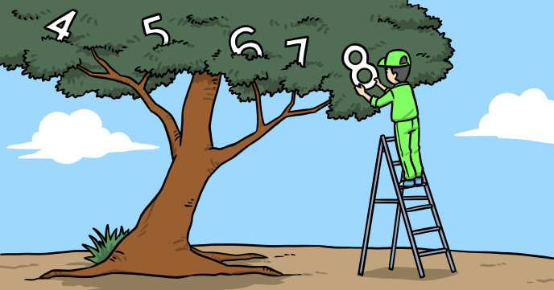

In this tutorial we will show you how to locate an element in an hierarchical structure.



There are many kind of hierarchical structures that need to be traversed in order to find an element (e.g. a file in a folder structure).

To simplify things we will use a JavaScript jagged array containg just numbers and / or other arrays of numbers:

```
var ar = [2, 4, 10, [12, 4, [100, 99], 4], [3, 2, 99], 0];
```

Let's see how to find the maximum number in this array.
 
## Source code 
The JavaScript source code of this program can be found [here](sketches/program.js). To run it, you need to import it in the [codeguppy.com](https://codeguppy.com) online editor. Alternatively, you can use the source code in your p5.js sketches (advanced use). 
## Online version 
To see the code running, check the online playground at [https://codeguppy.com/code.html?t=find_max](https://codeguppy.com/code.html?t=find_max) 
## Next steps 
Please check [codeguppy.com](https://codeguppy.com) for many other fun JavaScript programs and games for beginners. To stay up to date with CodeGuppy development please follow [@codeguppy](https://twitter.com/codeguppy) on Twitter.  
